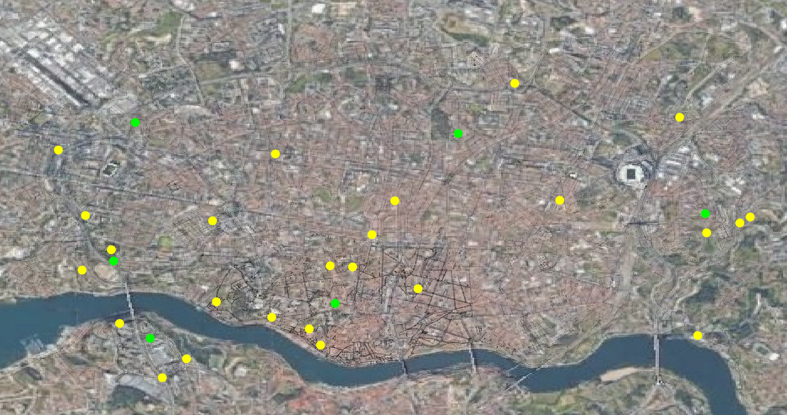
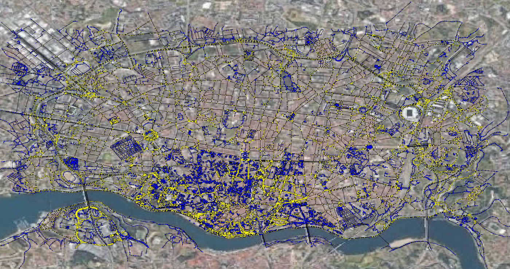
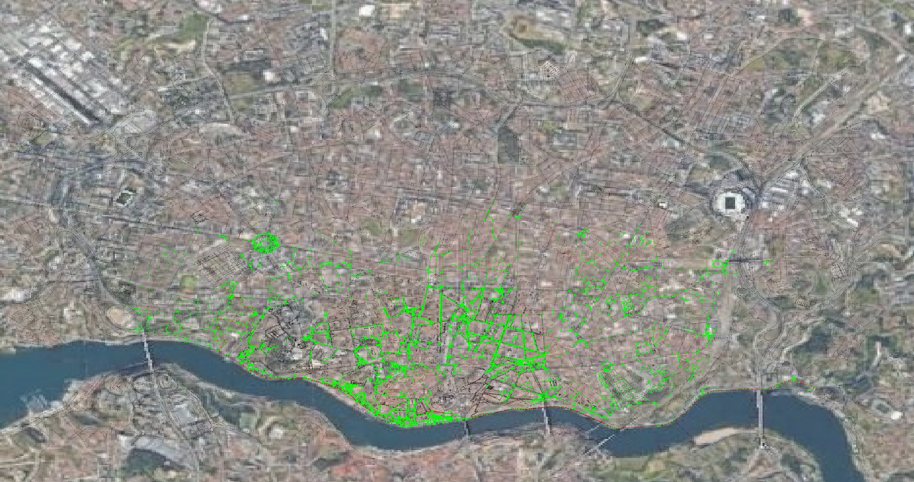
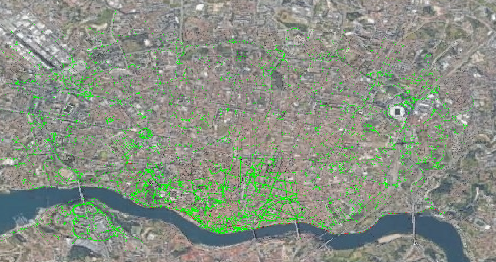
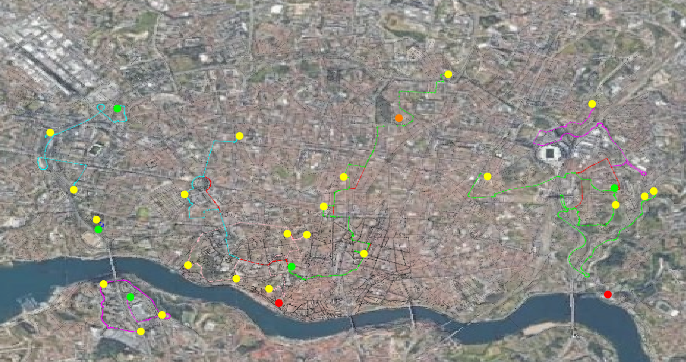

# CAL - Vaccine Router

## Description  

The purpose of this project is to distribute vaccines from 
a set of storage centers to a set of application centres 
minimizing the number of vehicles used without exceeding the 
vaccines conservation time.

The main concepts used for the development of this project are 
the **Travelling Salesman Problem**, **Vehicle Routing Problem** 
and the **Multi-Depot Vehicle Routing Problem**.

This project was developed by Diogo Luís Henriques Costa 
(up201906731@edu.fe.up.pt), Francisco José Barbosa Marques 
Colino (up201905405@edu.fe.up.pt) and Rui Filipe Teixeira 
Alves (up201905853@edu.fe.up.pt) for
[CAL 2020-21](https://sigarra.up.pt/feup/en/UCURR_GERAL.FICHA_UC_VIEW?pv_ocorrencia_id=459479).

## Products

The project final report can be found at
[report/2nd/CAL_relatorio_2MIEIC08_G2_entrega2.pdf](report/2nd/CAL_relatorio_2MIEIC08_G2_entrega2.pdf)
and the source code at [source](source).  

Compiling the source code is straight forward using the 
*CLion* IDE starting by reloading the CMake Project.

## Library Dependency

GraphViewerCpp at [source/lib/GraphViewerCpp](source/lib/GraphViewerCpp)

## Screenshots

Further details on the screenshots can be found at the *"Funcionalidades e 
cenários implementados"* section of the [report](report/2nd/CAL_relatorio_2MIEIC08_G2_entrega2.pdf).

### Load Map of *Porto*

### Strongly Connected Components

### A* Shortest Path

### Dijkstra Shortest Path

### Vaccine Distribution

